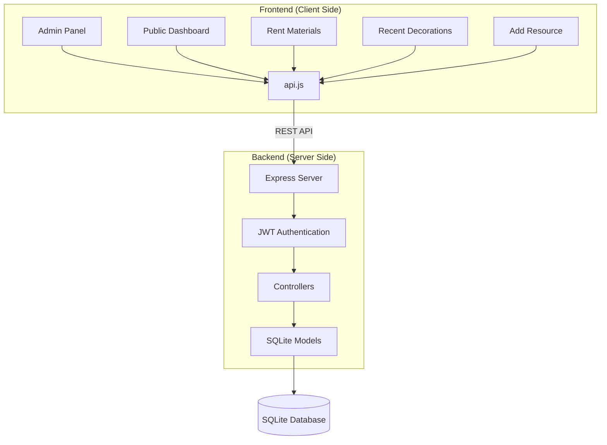

# System Architecture

DecoVentory follows a modern client-server architecture, separating the concerns of data management, business logic, and user interface.

## 🏗️ High-Level Component Diagram

## 💻 Frontend (The "Client")
The frontend is built using **Vanilla HTML, CSS, and JavaScript**. It is split into several independent modules, each serving a specific purpose:
- **Admin**: The core management interface for executives.
- **Dashboard**: The main public view showing current status and metrics.
- **Rent Materials**: Interface for external users to request borrowing.
- **Recent Decorations**: A showcase of past decoration events.
- **Add New Resource**: A dedicated interface for adding items to the inventory.

All frontend modules communicate with the backend through a shared utility file: `api.js`.

## ⚙️ Backend (The "Server")
The backend is a **Node.js** application powered by the **Express** framework. It follows the **MVC (Model-View-Controller)** pattern:
- **Routes**: Define the API endpoints.
- **Controllers**: Contain the business logic (e.g., calculating available quantities when items are borrowed).
- **Models**: Interact with the database using SQL queries.
- **Middleware**: Handles security tasks like JWT validation and CORS.

## 🗄️ Database
DecoVentory uses **SQLite**, a lightweight, serverless database engine. This choice makes the system easy to deploy and maintain while providing sufficient performance for inventory management.

## 🔗 Communication
The frontend and backend communicate over **HTTPS** using a **RESTful API**. Data is exchanged in **JSON** format. Secure endpoints require a **JSON Web Token (JWT)**, which is obtained upon a successful login with the executive passcode.
